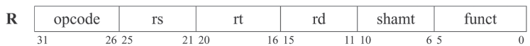
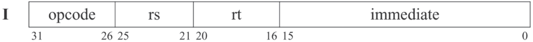
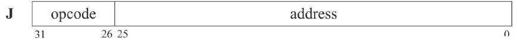

## R-type instructions


### Arithmatic & Logical instructions
| Instruction                | Syntax            | Operation (Pseudo-Code)           | Signed / Unsigned | Notes                          |
| -------------------------- | ----------------- | --------------------------------- | ----------------- | ------------------------------ |
| **Add**                    | `add rd, rs, rt`  | `R[rd] = R[rs] + R[rt]`           | Signed            | Traps on overflow              |
| **Add Unsigned**           | `addu rd, rs, rt` | `R[rd] = R[rs] + R[rt]`           | No overflow trap  | Uses normal 32-bit addition    |
| **Subtract**               | `sub rd, rs, rt`  | `R[rd] = R[rs] - R[rt]`           | Signed            | Traps on overflow              |
| **Subtract Unsigned**      | `subu rd, rs, rt` | `R[rd] = R[rs] - R[rt]`           | No overflow trap  | Uses normal 32-bit subtraction |
| **AND**                    | `and rd, rs, rt`  | `R[rd] = R[rs] & R[rt]`           | Logical           | Bitwise AND                    |
| **OR**                     | `or rd, rs, rt`   | `R[rd] = R[rs] \| R[rt]`          | Logical           | Bitwise OR                     |
| **NOR**                    | `nor rd, rs, rt`  | `R[rd] = ~(R[rs] \| R[rt])`       | Logical           | Bitwise NOR                    |
| **Set Less Than**          | `slt rd, rs, rt`  | `R[rd] = (R[rs] < R[rt]) ? 1 : 0` | Signed            | Signed comparison              |
| **Set Less Than Unsigned** | `sltu rd, rs, rt` | `R[rd] = (R[rs] < R[rt]) ? 1 : 0` | Unsigned          | Unsigned comparison            |

### Shift/Control instructions
| Instruction             | Syntax              | Operation                | Notes                             |
| ----------------------- | ------------------- | ------------------------ | --------------------------------- |
| **Shift Left Logical**  | `sll rd, rt, shamt` | `R[rd] = R[rt] << shamt` | Logical left shift                |
| **Shift Right Logical** | `srl rd, rt, shamt` | `R[rd] = R[rt] >> shamt` | Logical (zero-filled) right shift |
| **Jump Register**       | `jr rs`             | `PC = R[rs]`             | Absolute jump                     |

**jr range:** can jump to any $2^{32}$  word-aligned address value (4 GB space), absolute address (no offset)

## I-type instructions

- imm is signed value from $-32768(-2^{15})$ to $32767(2^{15}-1)$
- `SignExtImm = {16{imm[15]},imm}`
- `ZeroExtImm = {16{1'b0},imm}`
- `BranchAddr = {14{imm[15]},imm,2'b0}`
  

### Arithmatic imm instructions
| Instruction                          | Syntax              | Operation              | Extension Used | Notes                 |
| ------------------------------------ | ------------------- | -------------------------------------- | -------------- | --------------------- |
| **Add Immediate**                    | `addi rt, rs, imm`  | `R[rt] = R[rs] + SignExtImm`           | Sign-extend    | Traps on overflow     |
| **Add Immediate Unsigned**           | `addiu rt, rs, imm` | `R[rt] = R[rs] + SignExtImm`           | Sign-extend    | No overflow exception |
| **AND Immediate**                    | `andi rt, rs, imm`  | `R[rt] = R[rs] & ZeroExtImm`           | Zero-extend    | Logical mask          |
| **OR Immediate**                     | `ori rt, rs, imm`   | `R[rt] = R[rs] \| ZeroExtImm`          | Zero-extend    | Logical OR            |
| **Set Less Than Immediate**          | `slti rt, rs, imm`  | `R[rt] = (R[rs] < SignExtImm) ? 1 : 0` | Sign-extend    | Signed comparison     |
| **Set Less Than Immediate Unsigned** | `sltiu rt, rs, imm` | `R[rt] = (R[rs] < SignExtImm) ? 1 : 0` | Sign-extend    | Unsigned comparison   |

### Branch instuctions
| Instruction             | Syntax            | Branch Condition | PC Update                  | Range                       |
| ----------------------- | ----------------- | ---------------- | -------------------------- | --------------------------- |
| **Branch if Equal**     | `beq rs, rt, imm` | `R[rs] == R[rt]` | `PC = PC + 4 + BranchAddr` | ± $2^{15}$ instructions (~±128KB) |
| **Branch if Not Equal** | `bne rs, rt, imm` | `R[rs] != R[rt]` | `PC = PC + 4 + BranchAddr` | ± $2^{15}$ instructions (~±128KB) |

### Memory Access (Load/Store)
`EA = R[rs] + SignExtImm`\
`SignExtImm = {16{imm[15]},imm}`
| Instruction                | Syntax            | Operation              | Extension / Notes                 | Alignment      |
| -------------------------- | ----------------- | ------------------------------------ | --------------------------------- | -------------- |
| **Load Word**              | `lw rt, imm(rs)`  | `R[rt] = Memory[EA]` | Loads full 32 bits                | addr % 4 == 0  |
| **Load Halfword Unsigned** | `lhu rt, imm(rs)` | `R[rt] = {16'b0, Memory[EA](15:0)}`                                 | Zero-extend 16 → 32 bits          | addr % 2 == 0 |
| **Load Byte Unsigned**     | `lbu rt, imm(rs)` | `R[rt] = {24'b0, Memory[EA](7:0)}`                                 | Zero-extend 8 → 32 bits           | No restriction |
| **Load Upper Immediate**   | `lui rt, imm`     | `R[rt] = {imm, 16'b0}`               | Immediate placed in upper 16 bits | —              |
| **Store Word**             | `sw rt, imm(rs)`  | `Memory[EA] = R[rt]`                 | Stores full 32 bits               | addr % 4 == 0  |
| **Store Halfword**         | `sh rt, imm(rs)`  | `Memory[EA](15:0) = R[rt](15:0)`                         | Stores lower or upper 16 bits based on EA             | addr % 2 == 0  |
| **Store Byte**             | `sb rt, imm(rs)`  | `Memory[EA](7:0) = R[rt](7:0)`                         | Stores one of 4 Bytes based on EA              | No restriction |

### Alignment
**Imp:** In load half-word/byte full word is read and we choose half-word or byte based on EA

Example: To read half-word at 0x1002 we need to read whole word
```Address     Data
0x1000      0x12
0x1001      0x34
0x1002      0x56
0x1003      0x78
Word read: 0x12345678
Lower half (Address[1]=0): 0x1234
Upper half (Address[1]=1): 0x5678
```

### Atomic instuctions
| Instruction           | Syntax           | Operation (Pseudo-Code)                                                                 | What It Does                                | Notes                     |
| --------------------- | ---------------- | --------------------------------------------------------------------------------------- | ------------------------------------------- | ------------------------- |
| **Load Linked**       | `ll rt, imm(rs)` | `R[rt] = Memory[EA]`                                                                    | Loads word and sets reservation on EA       | Starts atomic sequence    |
| **Store Conditional** | `sc rt, imm(rs)` | If reservation valid:<br> `Memory[EA] = R[rt]`<br> `R[rt] = 1`<br>Else:<br> `R[rt] = 0` | Stores only if no write occurred since `ll` | Completes atomic sequence |


## J-type instructions

- JumpAddr = {PC+4[31:28],addr,2'b0}
- Jump range: $2^{28}$ B = 256 MB
  
**JumpAddr Intution:** PC = PC + 4 will anyways happen, we have 28 bits address after shifting, so why don't keep 4 upper-bits same
| Instruction       | Syntax     | Operation (Pseudo-Code)             | What It Does       | Notes                         |
| ----------------- | ---------- | ----------------------------------- | ------------------ | ----------------------------- |
| **Jump**          | `j addr`   | `PC = JumpAddr`                     | Unconditional jump | Within same 256MB region      |
| **Jump and Link** | `jal addr` | `R[31] = PC + 8` <br> `PC = JumpAddr` | Function call      | Saves return address in `$ra` |

**Note:** jal stores PC + 8 because MIPS executes the instruction immediately after the jump (**the delay slot**). Since that instruction is already executed before control transfers, the ra must skip it, which results in storing PC + 8.
